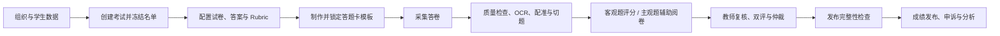

# EduGrade Enterprise

EduGrade Enterprise 是面向学校和教育机构的智能阅卷与学情分析平台。系统覆盖考试创建、试卷与评分标准配置、答题卡生成、答卷采集、OCR 与切题、客观题评分、主观题辅助阅卷、人工复核、仲裁、成绩发布、申诉及学习分析。

项目采用 monorepo 组织，支持 Web 管理后台、扫描工作站、Go 业务服务、Python Worker、内部阅卷 Agent 以及 Docker Compose 私有化部署。

> 当前 AI 能力遵循“模型提供建议，教师作出决定”的原则。模型结果不能绕过复核、质量门禁和发布流程直接成为最终成绩。

## 适用场景

- 学校统一考试、阶段测评、模拟考试和日常作业阅卷。
- 纸质答卷批量采集、页面质量检查、OCR、切题和客观题自动评分。
- 主观题按 Rubric 辅助评分，并支持单评、双评、复核和仲裁。
- 年级、班级和学生名单管理，以及考试冻结名册管理。
- 成绩确认、版本化发布、申诉、重评、审计和学情分析。
- 校内部署、数据不出校及本地模型接入。

## 核心能力

| 业务阶段 | 主要能力 |
| --- | --- |
| 考试准备 | 学校、学年、年级、班级和学生管理；分步骤创建考试；冻结考试名单 |
| 试卷配置 | 题目蓝图、试卷与答案 AI 解析、Question 对账、AnswerKey、Rubric、答题卡模板 |
| 答卷采集 | 受控答题卡、二维码身份、批量上传、页面质量检测、页面配准和异常处理 |
| 智能处理 | PaddleOCR、公式识别、答案区域切分、证据提取和处理状态追踪 |
| 阅卷管理 | 客观题规则评分、主观题建议、人工复核、双评、仲裁、回评和漂移监控 |
| 成绩发布 | 完整性检查、发布 Gate、不可变成绩快照、版本对比、申诉与重评 |
| 运营治理 | 权限控制、租户隔离、审计日志、模型治理、质量看板和系统状态 |

## 业务流程



系统中的考试名单、试题、评分标准、答题卡模板和成绩发布记录均具有明确的状态边界。考试进入 `ready` 后，正式试卷事实和答题卡布局将被冻结；成绩发布前必须通过名单、答卷、题目覆盖、复核和总分一致性检查。

## 快速开始：Docker Compose 私有化部署

以下步骤适合在 Windows 与 Docker Desktop 环境中完成首次本地部署。生产部署前，请继续阅读[私有化部署说明](infra/docker-compose/README.md)和[预生产 Runbook](docs/deployment/preproduction-runbook.md)。

### 1. 环境要求

- Git。
- Docker Desktop，并已启用 Docker Compose。
- PowerShell 7 或 Windows PowerShell 5.1。
- 至少 16 GB 内存；启用 OCR、页面处理和本地模型时建议准备更多内存。
- 如需使用本地智能阅卷模型，还需准备支持 OpenAI-compatible API 的 llama.cpp 运行时。

### 2. 获取代码并创建部署配置

```powershell
git clone https://github.com/damiao168/yuejuan.git
Set-Location yuejuan\infra\docker-compose
Copy-Item .env.example .env
```

编辑 `infra/docker-compose/.env`，至少替换以下配置：

- `EDUGRADE_POSTGRES_PASSWORD` 和对应的 `EDUGRADE_POSTGRES_DSN`。
- `EDUGRADE_REDIS_PASSWORD`。
- `EDUGRADE_MINIO_ACCESS_KEY`、`EDUGRADE_MINIO_SECRET_KEY`。
- `EDUGRADE_QDRANT_API_KEY`。
- `EDUGRADE_BARCODE_HMAC_KEYS`。
- `EDUGRADE_AI_SERVICE_TOKEN`。
- `EDUGRADE_GRAFANA_ADMIN_PASSWORD`。
- OCR、图像质量和页面处理 Worker 的用户名与密码。

密钥和服务令牌应使用随机值，长度不少于 32 个字符。不要提交 `.env`、模型 API Key 或真实密码。

### 3. 准备本地阅卷模型

在仓库根目录执行：

```powershell
powershell -ExecutionPolicy Bypass -File lab\scripts\prepare-local-runtime.ps1
powershell -ExecutionPolicy Bypass -File lab\scripts\start-local-server.ps1 -Candidate qwen3_4b
```

模型服务默认监听 `127.0.0.1:8087`。保持模型服务运行，然后同步运行时 API Key：

```powershell
Set-Location infra\docker-compose
.\scripts\sync-local-grading-model-key.ps1
```

如使用其他 OpenAI-compatible 模型服务，请在 `.env` 中配置 `EDUGRADE_GRADING_MODEL_BASE_URL`、`EDUGRADE_GRADING_MODEL_API_KEY` 和模型名称，并在上线前完成对应的质量评测。

### 4. 预检并初始化系统

首次部署时设置平台管理员密码。该密码只通过当前进程传入，不要写入仓库：

```powershell
$env:EDUGRADE_BOOTSTRAP_PASSWORD = "<强密码，至少 12 位>"
.\scripts\preflight.ps1
.\scripts\init.ps1 -BootstrapAdmin -EnableOcr -EnableQuality -EnableProcessing
Remove-Item Env:EDUGRADE_BOOTSTRAP_PASSWORD
```

初始化脚本会依次执行环境预检、基础服务启动、数据库迁移、MinIO 初始化、应用构建、管理员创建和健康检查。不要在迁移执行期间中断进程。

完成首次初始化后，日常启动请回到仓库根目录运行以下脚本。它会复用已有
Docker 镜像，并把 PaddleOCR/公式模型持续保存在项目的 `.cache/ocr-models`：

```powershell
Set-Location ..\..
powershell -ExecutionPolicy Bypass -File scripts\start-local.ps1
```

只有依赖或源码发生变化、确实需要重建镜像时才追加 `-Build`。不要把
`docker compose up -d --build` 当作每次启动命令。

需要同时启用 Prometheus 和 Grafana 时，增加 `-EnableObservability`：

```powershell
.\scripts\init.ps1 -SkipBuild -EnableOcr -EnableQuality -EnableProcessing -EnableObservability
```

### 5. 检查服务状态

```powershell
docker compose --env-file .env -f docker-compose.yml ps
```

核心服务应显示为 `running` 或 `healthy`。默认访问地址如下：

| 服务 | 地址 | 用途 |
| --- | --- | --- |
| EduGrade Web | `http://127.0.0.1:8088` | 用户操作入口 |
| API Gateway | `http://127.0.0.1:8080` | API 与健康检查 |
| MinIO Console | `http://127.0.0.1:9001` | 文件存储管理，仅限运维人员 |
| Qdrant | `http://127.0.0.1:6333` | 向量服务，仅限内部访问 |
| Grafana | `http://127.0.0.1:3000` | 可观测性，启用 profile 后可用 |

### 6. 首次登录

打开 `http://127.0.0.1:8088`，使用初始化时创建的平台管理员登录：

- 机构代码：`platform`
- 用户名：`platform_admin`
- 密码：初始化时通过 `EDUGRADE_BOOTSTRAP_PASSWORD` 设置的密码

平台管理员用于完成租户和初始管理员配置。学校日常业务应使用学校管理员或教师账号，不建议长期使用平台管理员处理考试。

## 学校管理员操作指南

### 一、完成机构启用

1. 登录后进入“组织与用户”或首次启用向导。
2. 创建学校，填写稳定且唯一的学校代码。
3. 创建学年、届别/年级和班级，确认班级所属学年与年级正确。
4. 下载学生导入模板，填写学号、姓名和班级代码后上传 CSV。
5. 在导入预览中处理重复学号、未知班级和必填字段错误，再确认导入。
6. 创建学校管理员、年级管理员和阅卷教师账号，并按岗位分配角色。
7. 使用业务账号重新登录，确认学校、班级和学生范围符合权限预期。

更完整的首次启用说明见[机构启用与考试工作区操作说明](docs/user-guides/organization-onboarding-and-exam-workspace.md)。

### 二、创建考试

1. 打开“考试”，点击“新建考试”。
2. 填写考试名称、科目、考试类型和考试时间。
3. 选择学校、学年、年级和参考班级。
4. 设置总分、题型、题量及各题分值。系统会按蓝图预生成正式 Question。
5. 选择阅卷方式、成绩发布策略和申诉策略。
6. 在确认页检查总分、题目数量和参考范围，然后创建考试。
7. 创建后进入考试工作区，不要重复创建同一场考试。

### 三、配置试卷、答案和评分标准

1. 在考试工作区打开“试卷与评分标准”。
2. 上传正式试卷 PDF。扫描版 PDF 会进入现有页面处理与 OCR 流程。
3. 上传答案或包含答案的文件，等待 AI 解析完成。
4. 在解析预览中逐题核对题号、题型、分值、题干、标准答案和 Rubric。
5. 如页面显示分值、题型、漏题、多题或总分不一致，先人工修正；系统不会静默覆盖考试蓝图。
6. 确认无误后点击应用，将内容补充到预生成 Question。
7. 对主观题进一步完善 Rubric、采分点和允许的等价答案。

### 四、制作答题卡并确认开考准备

1. 上传或创建答题卡模板。
2. 点击“自动识别区域”生成候选答题区域。
3. 逐页核对题号关联和识别置信度，必要时移动、缩放、删除或重新框选区域。
4. 保存草稿并预览答题卡，确认二维码、页码和所有题目区域完整。
5. 锁定模板，并按冻结名单生成受控打印答题卡。
6. 打开“开考准备”，依次处理未通过项目。
7. 确认 readiness 后，系统冻结考生名单、试题、答案、Rubric 和正式答题卡布局。

> 进入 `ready` 后不能继续修改正式试题或锁定新模板。如确需调整，应按学校流程取消当前考试或新建考试版本，不要直接修改数据库。

### 五、采集与处理答卷

1. 打开考试工作区的“答卷采集”，创建采集批次。
2. 上传扫描 PDF 或图片；建议同一批次使用一致的扫描参数和页面方向。
3. 启动处理后，关注页面质量、身份识别、页码、配准、OCR 和切题状态。
4. 对模糊、缺页、重复页、未知考生、二维码冲突或配准失败页面进入异常处理。
5. 核对受控答题卡身份。系统会按打印时绑定的模板 ID 和内容 hash 配准，不会自动改用后来创建的模板版本。
6. 所有有效答卷完成切题后，再进入评分阶段。

### 六、阅卷、复核和仲裁

1. 客观题先运行规则评分，检查未识别选项和低置信度结果。
2. 主观题进入阅卷工作台，教师根据原始答题证据、Rubric 和 AI 建议评分。
3. AI 建议仅用于辅助判断；教师应核对采分点、证据位置和分值上限。
4. 对达到双评条件的题目完成第二次独立评分。
5. 对分差超阈值、证据冲突或质量异常的答案进入仲裁。
6. 完成所有复核任务后，确认每位考生每道题均存在最终成绩。

### 七、发布成绩

1. 打开“成绩管理”，先执行发布前检查。
2. 处理所有阻断项，包括缺少答卷、身份未确认、缺页、OCR 失败、未完成复核、题目覆盖不完整和总分不一致。
3. 确认考试 Question 集合、每份答卷的 AnswerSegment 集合和 FinalGrade 集合一致。
4. 生成成绩发布草稿并复核人数、总分、异常数和发布范围。
5. 由具备权限的管理员显式发布。发布后系统保存不可变成绩快照和审计记录。
6. 后续更正通过申诉、重评或新的发布版本完成，不直接覆盖历史发布记录。

## 常见问题

### 页面无法打开或登录失败

先确认容器状态：

```powershell
Set-Location infra\docker-compose
docker compose --env-file .env -f docker-compose.yml ps
docker compose --env-file .env -f docker-compose.yml logs --tail 200 api-gateway nginx
```

检查访问地址是否为 `http://127.0.0.1:8088`，并确认机构代码、用户名和密码对应同一租户。连续输错密码可能触发临时登录限制。

### 看不到某个菜单

菜单按角色和数据范围显示。请联系管理员核对用户角色、学校范围及年级范围。不要通过共享管理员账号绕过权限检查。

### 试卷 AI 解析没有自动应用

这是预期行为。解析结果必须先进入预览；题型、分值、总分、漏题或多题不一致时必须人工确认。低置信度 OCR 结果不会自动写入正式试卷。

### 答卷一直停留在处理中

检查 OCR、图像质量和页面处理 Worker 是否已启动：

```powershell
docker compose --env-file .env -f docker-compose.yml --profile ocr --profile quality --profile processing ps
docker compose --env-file .env -f docker-compose.yml logs --tail 200 ocr-worker image-quality-worker page-processing-worker
```

不要重复上传同一文件。先根据页面错误码处理 Worker 凭据、模型连接、文件格式或页面质量问题，再使用系统提供的重试操作。

### 发布按钮不可用

发布 Gate 采用失败关闭策略。打开成绩页面查看阻断项，优先处理名单、未知答卷、缺页、题目覆盖、未完成评分和总分一致性问题。不能通过直接修改数据库绕过发布检查。

## 本地开发

### 开发环境

- Node.js 20+ 与 npm。
- Go 1.26。
- Python 3.11+。
- Docker Desktop，用于依赖服务和容器验收。
- 构建桌面端时还需要 Rust、Cargo 和 Tauri Windows 依赖。

### Web 管理后台

```powershell
npm.cmd install
npm.cmd run typecheck
npm.cmd run dev
```

默认开发地址为 `http://127.0.0.1:5173`，以 Vite 实际输出为准。

生产构建与单元测试：

```powershell
npm.cmd run build
npm.cmd --workspace apps/web-admin test
```

### Go API

```powershell
Set-Location services\api-gateway
go test ./... -count=1
go run ./cmd/api-gateway
```

本地运行 API 前，应从根目录 `.env.example` 创建仅供本机使用的配置，并确保 PostgreSQL、Redis、MinIO 等依赖可用。

### Python 服务与 Worker

```powershell
python -m pytest services\ocr-worker\tests -q
python -m pytest services\page-processing-worker\tests -q

$env:PYTHONPATH = "ai-services"
python -m unittest discover -s ai-services\tests -p "test_*.py"
```

### 桌面端

```powershell
npm.cmd --workspace apps/desktop-client run dev
npm.cmd --workspace apps/desktop-client run build
npm.cmd --workspace apps/desktop-client run tauri:dev
```

## 系统架构与边界

- Web Admin 负责考试、试卷、采集、阅卷、成绩和治理操作。
- Go API Gateway 是生产业务请求、权限校验和结果落库的唯一入口。
- OCR、图像质量、页面处理和主观题 Worker 通过现有 Worker Runtime 执行异步任务。
- `grading-agent` 只处理去身份化评分请求，返回带证据的教师建议。
- Lab 负责模型、提示词、评测、校准和发布门禁，不直接访问生产数据库。
- PostgreSQL 保存业务事实，MinIO 保存受控文件，Redis 用于运行时协调，Qdrant 用于受治理的检索能力。
- 最终成绩必须由平台业务流程确认和发布，AI、Lab 与 Worker 均不具备成绩发布权限。

主观题 AI 边界：

| 能力 | 当前行为 |
| --- | --- |
| 短答题、计算题 | 可生成 `teacher_suggestion`，必须人工复核 |
| 作文、论述题 | 仅保存 `shadow_only` 影子结果 |
| 证据 | 必须来自学生答案，服务端重新校验 |
| 分数 | 服务端按已匹配采分点重新计算，不信任模型总分 |
| 置信度 | 未完成生产校准时使用保守治理值 |
| 最终成绩 | 只能由正式业务流程确认、发布和锁定 |

## 仓库结构

```text
apps/
  web-admin/                 Web 管理后台
  desktop-client/            Windows/Tauri 扫描工作站
  teacher-portal/            教师端边界
  student-portal/            学生端
services/
  api-gateway/               Go API、业务流程、迁移和 Worker Runtime
  ocr-worker/                OCR 与版面文本识别
  page-processing-worker/    PDF 解码、页面配准和切题处理
  image-quality-worker/      页面质量检测与规范化
  subjective-grading-worker/ 主观题异步阅卷任务
ai-services/
  grading_agent/             内部智能阅卷 Agent
  prompts/                   版本化提示词及 manifest
contracts/                   跨服务契约
lab/                         模型适配、评测、校准与发布门禁
infra/docker-compose/        私有化部署和运维脚本
docs/                        产品、架构、API、安全、部署和用户文档
tests/                       E2E、负载、安全和容器验收测试
```

## 质量验证

提交前建议执行：

```powershell
npm.cmd run typecheck
npm.cmd run build
npm.cmd run check:openapi-breaking
npm.cmd run check:lab-integration

Set-Location services\api-gateway
go test ./... -count=1
```

Compose 配置检查：

```powershell
docker compose --env-file infra\docker-compose\.env.example `
  -f infra\docker-compose\docker-compose.yml config --quiet
```

## 当前状态

- 当前能力和验证证据以[验证状态文档](docs/verification-status.md)为准。
- AI 阅卷仍是教师建议，不具备自动发布最终成绩的权限。
- 作文和论述题目前只允许 `shadow_only`。
- Mock、协议模拟器和合成数据只能证明技术链路，不代表真实学校数据上的模型效果。
- 生产 Pilot 前仍需完成真实受治理数据评测、教师一致性、置信度校准、公平性检查、容量测试和恢复演练。
- 模型文件、运行时密钥、数据库密码和部署 `.env` 不应提交到 Git。

## 文档索引

- [机构启用与考试工作区操作说明](docs/user-guides/organization-onboarding-and-exam-workspace.md)
- [当前能力与验证状态](docs/verification-status.md)
- [私有化部署说明](infra/docker-compose/README.md)
- [预生产部署 Runbook](docs/deployment/preproduction-runbook.md)
- [企业验收清单](docs/deployment/enterprise-acceptance-checklist.md)
- [系统架构](docs/architecture/overview.md)
- [生产安全与可靠性](docs/architecture/production-security-and-reliability.md)
- [API 错误模型](docs/api/errors.md)
- [主观题阅卷 API](docs/api/subjective-grading.md)
- [Lab 使用说明](lab/README.md)

## 安全与责任说明

EduGrade 处理学生身份、答卷和成绩等敏感教育数据。部署方应根据所在地法律法规和学校制度配置访问控制、数据保留、备份、审计、网络隔离和模型使用政策。任何 AI 输出都应由具备资质的教育工作者审核，不应作为影响学生权益的唯一依据。
