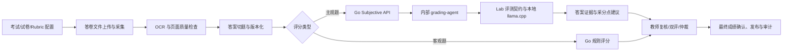

# EduGrade Enterprise

EduGrade Enterprise 是面向学校和教育机构的企业级智能阅卷与学情分析平台。项目采用 monorepo 组织，覆盖试卷配置、答卷采集、OCR、切题、客观题评分、主观题智能阅卷、人工复核、仲裁、成绩发布、申诉和学习分析。

当前主线已经接入 Lab 的智能体阅卷能力，但仍遵守“建议优先、人工决策”的产品边界：模型输出只能作为教师建议，不能直接发布为最终成绩。

## 产品边界

- Web 管理后台负责考试、试卷、Rubric、答卷、阅卷、成绩和运营配置。
- Go API Gateway 是所有生产业务请求和评分结果落库的唯一入口。
- Python `grading-agent` 只处理去身份化的主观题评分请求，返回带证据的教师建议。
- Lab 是模型、提示词、证据验证和质量门禁的离线边界，不直接访问生产数据库，也不能发布成绩。
- 最终成绩必须经过教师复核、必要时的双评/仲裁，并由平台显式发布和锁定。

## 核心链路



主观题链路的关键约束：

| 能力 | 当前行为 |
| --- | --- |
| 短答题、计算题 | 可生成 `teacher_suggestion`，必须人工复核 |
| 作文、论述题 | 仅保存 `shadow_only` 影子结果 |
| 证据 | 必须来自学生答案文本，服务端重新校验 |
| 分数 | 服务端根据匹配采分点重新计算，不信任模型总分 |
| 置信度 | 当前固定为 `0`，表示尚未完成生产校准 |
| 最终成绩 | AI 不具备发布权限，`final_grade` 只能由业务流程确认 |

## 当前已接入能力

- Go API Gateway：认证、租户隔离、RBAC、考试/试卷/答卷、OCR 任务、切题、评分、复核、仲裁、成绩和报表 API。
- Web Admin：React 19、TypeScript、Vite、Ant Design，包含考试工作区、试卷与 Rubric、答卷采集、阅卷工作台、仲裁、成绩、申诉、审计和阅卷运营页面。
- Desktop Client：Tauri 2 + React + TypeScript，提供扫描工作站、离线阅卷基础能力、同步队列和本地诊断入口。
- AI 服务：`ai-services/grading_agent` 提供内部认证、幂等、模型就绪检查、输出校验、证据校验和隐私安全遥测。
- Lab：本地模型适配器、能力矩阵、提示词注册、合成评测、对抗样本、校准/公平性检查和发布门禁。
- 私有化部署：Docker Compose 包含 API、Web、PostgreSQL、Redis、MinIO、Qdrant、内部 `grading-agent`、Nginx，以及可选的迁移、OCR、质量和可观测性服务。

## 技术栈

- 前端：React 19、TypeScript、Vite、Ant Design、Recharts、Framer Motion。
- 后端：Go 1.24、PostgreSQL、Redis、MinIO、Qdrant。
- Agent 服务：Python 3.11+、标准库 HTTP 服务、OpenAI-compatible llama.cpp API。
- 本地模型验证：Lab 固定候选模型与提示词版本，当前本地验证使用 Qwen3-4B GGUF。
- 桌面端：Tauri 2、Rust、React、TypeScript。
- 部署：Docker Compose、Nginx、PowerShell 运维脚本。

## 仓库结构

```text
apps/
  web-admin/                 Web 管理后台
  desktop-client/            Windows/Tauri 客户端
  teacher-portal/            教师端预留边界
  student-portal/            学生端预留边界
services/
  api-gateway/               Go API、业务流程、数据库迁移和 Worker Runtime
ai-services/
  grading_agent/             内部智能体阅卷服务
  prompts/                   版本化提示词及 manifest
contracts/
  grading-agent/v1/          跨服务请求、响应和错误契约
lab/
  config/                    能力、数据集、模型和发布门禁配置
  src/                       评测、模型适配器、证据和质量逻辑
  evals/                     受治理数据、报告和回归样本
infra/docker-compose/        私有化部署、预检、初始化、备份和恢复
docs/                        PRD、架构、API、数据库、安全、部署和 Story
tests/                       E2E、负载、安全和容器验收测试
scripts/                    主项目与 Lab 集成门禁脚本
```

## 本地开发

### 环境要求

- Node.js 20+ 和 npm。
- Go 1.24。
- Python 3.11+。
- Docker Desktop（运行 Compose 和容器 E2E 时需要）。
- 构建桌面端还需要 Rust、Cargo 以及 Tauri 的 Windows 打包依赖。

### 安装依赖与启动 Web

```powershell
npm.cmd install
npm.cmd run typecheck
npm.cmd run build
npm.cmd run dev
```

默认 Web 管理后台地址为 `http://127.0.0.1:5173`（以 Vite 输出为准）。

桌面端命令：

```powershell
npm.cmd --workspace apps/desktop-client run dev
npm.cmd --workspace apps/desktop-client run build
npm.cmd --workspace apps/desktop-client run tauri:dev
npm.cmd --workspace apps/desktop-client run tauri:build
```

### Go API 与 Agent 测试

```powershell
Set-Location services/api-gateway
go test ./... -count=1

Set-Location ../..
$env:PYTHONPATH = "ai-services"
python -m unittest discover -s ai-services/tests -p "test_*.py"
```

## Lab 与真实模型验证

Lab 的集成检查从仓库根目录执行：

```powershell
npm.cmd run check:lab-integration
npm.cmd run check:story057
```

该检查会运行 Lab 单测、合成评测、开发级发布门禁、主项目客观题测试，以及能力边界、证据、分数上限、Mock 标记和 Pilot readiness 检查。

需要验证本地 Qwen3-4B 模型时：

```powershell
powershell -ExecutionPolicy Bypass -File lab\scripts\prepare-local-runtime.ps1
powershell -ExecutionPolicy Bypass -File lab\scripts\start-local-server.ps1 -Candidate qwen3_4b
```

llama.cpp 默认监听 `127.0.0.1:8087`。模型和运行时文件位于 `lab/.runtime`，不会提交到 Git。

## Docker Compose 私有化部署

先准备配置：

```powershell
Set-Location infra\docker-compose
Copy-Item .env.example .env
```

在 `.env` 中替换数据库、Redis、MinIO、Grafana 密码，以及长度不少于 32 个字符的 `EDUGRADE_AI_SERVICE_TOKEN`。不要把真实密钥写入仓库。

如果使用 Lab 本地模型，启动模型后同步 API key：

```powershell
.\scripts\sync-local-grading-model-key.ps1
.\scripts\preflight.ps1
.\scripts\init.ps1
docker compose --env-file .env -f docker-compose.yml up -d --build
```

`grading-agent` 只监听 Compose 内网 `8100`，不映射宿主机端口，也不经过 Nginx 暴露。它通过 `host.docker.internal:8087` 访问宿主机上的 llama.cpp。

常用地址：

- Web：`http://127.0.0.1:8088`
- API：`http://127.0.0.1:8080`
- MinIO Console：`http://127.0.0.1:9001`
- Qdrant：`http://127.0.0.1:6333`

容器健康检查：

```powershell
docker compose --env-file .env -f docker-compose.yml ps
docker compose --env-file .env -f docker-compose.yml exec grading-agent wget -q -O - http://127.0.0.1:8100/health
docker compose --env-file .env -f docker-compose.yml exec grading-agent wget -q -O - http://127.0.0.1:8100/ready
```

更多备份、恢复、升级和隔离验收步骤见 [`infra/docker-compose/README.md`](infra/docker-compose/README.md) 和 [`docs/deployment/preproduction-runbook.md`](docs/deployment/preproduction-runbook.md)。

## 质量门禁与验证命令

常用检查：

```powershell
npm.cmd run typecheck
npm.cmd run build
npm.cmd run check:lab-integration
npm.cmd run check:story057
Set-Location services/api-gateway; go test ./... -count=1
```

Compose 配置检查：

```powershell
docker compose --env-file infra\docker-compose\.env.example `
  -f infra\docker-compose\docker-compose.yml config -q
```

真实模型适配器 E2E 是显式 opt-in 的长耗时测试，需要先启动本地 Agent 和 llama.cpp：

```powershell
Set-Location services/api-gateway
$env:EDUGRADE_REAL_GRADING_AGENT_URL = "http://127.0.0.1:18100"
$env:EDUGRADE_REAL_GRADING_AGENT_TOKEN = "<local-service-token>"
go test ./internal/subjective -run TestHTTPAdapterRealLocalAgent -count=1 -v
```

## 当前状态与未完成项

- Lab 到主项目的真实请求链路已经接入并通过本地模型验证。
- AI 阅卷仍是影子建议，不具备自动发布最终成绩的权限。
- `confidence=0` 是有意的治理信号，生产 Pilot 前还需要真实受治理数据、教师一致性、校准、公平性和模型选择证据。
- 作文和论述题当前只允许 `shadow_only`。
- Docker 容器级验收依赖本机 Docker Desktop 守护进程；没有可用 Docker 时，只能完成服务级和本地模型验证。
- GGUF 模型、llama.cpp 二进制、运行时 API key、数据库密码和 `.env` 永远不应提交到 Git。

## 重要文档

- [主项目与 Lab 集成说明](docs/integration/lab-main-project.md)
- [主观题阅卷 API](docs/api/subjective-grading.md)
- [Grading Agent 生产契约](docs/stories/STORY-057-grading-agent-production-contract.md)
- [Grading Agent 服务](docs/stories/STORY-058-grading-agent-service.md)
- [平台接入与落库](docs/stories/STORY-059-platform-grading-agent-integration.md)
- [私有化部署说明](infra/docker-compose/README.md)
- [预生产部署 Runbook](docs/deployment/preproduction-runbook.md)
- [Lab 使用说明](lab/README.md)
- [Story 与验收文档](docs/stories)

## Story 工作方式

项目按 Story 推进。每个 Story 应明确范围、数据边界、失败语义、验收命令和未完成项；实现完成后先运行对应门禁，再更新 Story 文档和验证证据。不要用占位接口、Mock 数据或“接口能通”替代真实业务能力，也不要绕过人工复核和审计链路。
