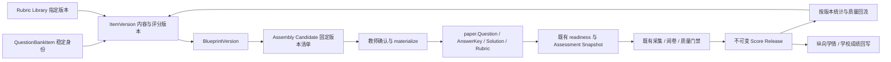

# Assessment Platform 路线图：STORY-069～078

- 状态：In Progress；069A 题库核心草稿与 069B 评分 bundle/审核发布/指定版本进入考试已实现、验证并自审批准，其余切片保持 Planned。验收记录见 [069A](../stories/STORY-069A-question-bank-core-item-version.md)与 [069B](../stories/STORY-069B-answer-rubric-publish-workflow.md)。
- 规划日期：2026-09-13。
- 需求来源：用户提供的“版本化题库 → Rubric 库 → 考试蓝图 → 智能组卷 → 质量回流 → 纵向学情 → 学校集成”方案。
- 代码审阅基线：当前工作分支 `fix/postgres-integration-regressions`，修改前 HEAD `5ec969389c30fd07851135e901775b88d160872b`；本地 `main` 为 `494124407a86d59df1b15e6cf3e3392da8c7630d`。两者不同，本文的代码结论以工作分支为准，未宣称核验远端最新 main。
- 能力与证据口径继续以[当前能力与验证状态](../verification-status.md)为准；历史验证快照不能替代后续 Story 的验收。

## 产品目标与范围

将考试中的题目、答案、解析和评分标准沉淀为可审核、可复用、可追溯的资产，用显式蓝图构造后续考试，再把已发布成绩的题目统计回流到资产治理。学校集成与纵向学情在同一不可变事实链上扩展。

本路线图规划 STORY-069～078，以及 069A～069F、070A～070F。第一阶段交付目标为 **069A～069F + 070A～070C**；071 属于同一内容资产产品阶段的治理深化。第一阶段不要求平行卷、外部优化 Worker、QTI、IRT 或 Knowledge Tracing。

## 已核对的底座与方案修正

| 事实 | 代码入口 | 规划含义 |
| --- | --- | --- |
| Question 直接持有 ExamID、ExamPaperID，答案、解析、Rubric 为考试内配置 | [paper/types.go](../../services/api-gateway/internal/paper/types.go) | 题库放在 paper 上游；不把 Question 改造成全局内容对象 |
| readiness 快照冻结题干、题型、archetype、分值、答案、解析、Rubric 与答题卡事实 | [paper/readiness_snapshot.go](../../services/api-gateway/internal/paper/readiness_snapshot.go) | materialize 后走既有 ready 门禁；不新建替代门禁 |
| Assessment Snapshot 冻结 Profile、Archetype、风险与评分策略 | [assessment/snapshot.go](../../services/api-gateway/internal/assessment/snapshot.go)、[Assessment Domain](../architecture/assessment-domain.md) | 题库内容不能绕过学科配置与 AI 准入；两类快照职责保持一致 |
| DocumentImportService 已提供候选契约，但 Start 需要 examID，Store 也绑定考试导入 | [paper/document_import.go](../../services/api-gateway/internal/paper/document_import.go) | 069E 先支持已有导入候选入库；独立题库 PDF 导入需抽出共享解析边界，不能直接传空 examID 或伪造考试 |
| report 已计算得分率、区分度和选项分布，但 loadDataset 读取 final_grade 并 join 当前 question | [report/store_postgres.go](../../services/api-gateway/internal/report/store_postgres.go)、[report/stats.go](../../services/api-gateway/internal/report/stats.go) | 069F 复用纯计算逻辑，新增基于 Score Release 的输入适配；不能把现有查询当不可变统计源 |
| Score Release 已具备题级快照、后继版本和 current 指针 | [scorerelease/types.go](../../services/api-gateway/internal/scorerelease/types.go)、[scorerelease/store_postgres.go](../../services/api-gateway/internal/scorerelease/store_postgres.go) | 统计、回写与趋势显式记录 release_id；重发布保留历史并替换当前投影贡献 |
| 事务型 event_outbox、租约重试和 dispatcher 已存在；当前 Publisher 写日志 | [outbox/outbox.go](../../services/api-gateway/internal/outbox/outbox.go)、[outbox/publisher_log.go](../../services/api-gateway/internal/outbox/publisher_log.go)、[server/infrastructure.go](../../services/api-gateway/internal/server/infrastructure.go) | 072 扩展语义事件与站内投递；复用 outbox，避免重建或同时争抢同一事件的独立消费者 |
| 权限已有服务端 AccessScope 与资源校验 | [auth/access_scope.go](../../services/api-gateway/internal/auth/access_scope.go) | 题库需增加 bank 范围校验；已有角色不能自动获得所有保密题库权限 |
| 当前索引仍把 064～067 指向历史计划，实际文档已占用这些编号，068 已存在 | [Story 索引](../stories/README.md) | 修正当前映射，保留历史语义说明；新能力从 069 开始，不覆盖已有 Story |

当前工作分支顶层迁移最高号为 `000139`，不是 Story 号。实施时重新读取 `services/api-gateway/migrations` 的最高号并顺延，再运行 `npm run sync:schema-version` 和 `npm run check:schema-version`；本次不预占迁移号。

## 领域边界与不可变事实

1. **Item 是逻辑身份，ItemVersion 是测量事实。** Item 的编号、生命周期和当前发布指针可治理；题干、答案、Rubric、知识点和组卷用 metadata 属于版本事实。统计按版本存储，逻辑 Item 只提供明确标注的版本概览。
2. **审批绑定内容 revision 与 hash。** draft 可用 expected_revision 更新；reviewing、approved、published 内容锁定。退回后修改使审批失效，重新审核。published 只能派生新 draft；答案、解析、Rubric、metadata 或附件绑定不能通过子表更新绕过锁定。
3. **评分绑定是显式版本。** ItemVersion 绑定指定 AnswerVersion、Solution 事实和 RubricVersion；通用 Rubric 模板具有独立身份与版本，题目选用后冻结为题目评分事实。模板后来发布新版不能刷新已有题目。
4. **materialize 复制事实。** 单事务创建考试 Question、AnswerKey、Solution、Rubric 和必要 Assessment 配置，写入来源 Item/Version/hash 与命令回执；任一失败全回滚。答题区域由目标答题卡配置，不能把历史考试坐标当新考试通用区域。
5. **来源哈希与考试哈希分别计算。** 来源 hash 覆盖 schema_version、题型/archetype、题干、选项、默认分值、答案/等价答案/容差、解析、Rubric、版本 metadata 与附件摘要；排除审计时间、存储路径与来源记录。对象键稳定排序，数组按语义保序，分值使用精确十进制规范。题目使用内容与评分子摘要辅助查重，完整 bundle hash 用于验真。
6. **来源追溯不改变旧考试有效性。** question 增加 source_type、source_bank_item_id、source_bank_item_version_id、source_content_hash。这里 source_type 表示内容来源；现有 score_release_question.source_type 表示 single_review/rule_auto 等评分来源，不能写入 question_bank 或复用为内容追溯。来源事实在 materialize 后不可改，随版本化快照扩展持久化；旧快照继续按旧 schema 解释，不补算或静默更改历史 hash。退役、归档与附件生命周期不得破坏已有考试的事实读取。
7. **默认按原分值使用题目。** 第一阶段不隐式缩放 Rubric；候选的默认分值与实际考试分值必须相同。已有来源题目在考试内被编辑后保留来源，标记内容偏离，不能把该实例统计并入原版本校准样本。
8. **权限先过滤再统计或搜索。** 租户复合外键负责跨租户拒绝，bank ACL 负责同租户内容隔离。列表总数、查重、附件、历史与统计同样校验；结构管理权限与内容读取权限分开。

## Story 优先级与依赖

| 顺序 | Story | 优先级 | 交付结果 | 主要依赖 |
| --- | --- | --- | --- | --- |
| 1 | [069 版本化题库与 Rubric 库](../stories/STORY-069-versioned-question-bank-rubric-library.md) | P0 | 可审核题目资产、指定版本用于考试、来源追溯 | 既有 paper、assessment、auth、files、command receipt |
| 2 | [070 考试蓝图与智能组卷](../stories/STORY-070-assessment-blueprint-smart-assembly.md) | P0 | 可解释的约束、确定性候选与曝光控制 | 069B/C/F；069D/E 供给内容 |
| 3 | [071 题目质量与曝光治理](../stories/STORY-071-question-quality-exposure-governance.md) | P0 | 版本级质量信号、审核治理与题池健康 | 069F、070C |
| 4 | [072 通知与事件中心](../stories/STORY-072-notification-event-center.md) | P0 | 语义事件和站内通知 | 已有 outbox；无需等待 071 的所有指标 |
| 5 | [073 学校集成中心](../stories/STORY-073-integration-hub.md) | P0 | OneRoster CSV Diff/Apply，再扩展 REST/Webhook/LTI | 既有组织与发布事实；Webhook 依赖 072 |
| 6 | [074 企业身份与 MFA](../stories/STORY-074-enterprise-identity-mfa.md) | P1 | OIDC、TOTP、高风险操作 step-up | 既有 auth；学校 IdP 配置 |
| 7 | [075 跨考试纵向学情](../stories/STORY-075-assessment-series-longitudinal-analytics.md) | P1 | 发布版本可追溯的系列趋势 | Score Release；069C 的受控知识点增强可比性 |
| 8 | [076 考试运营中心](../stories/STORY-076-exam-operations-center.md) | P1 | 多科考试阻断、进度与可解释估时 | 既有 exam_session、dashboard、processing、review、release gate |
| 9 | [077 学习反馈与错因体系](../stories/STORY-077-learning-feedback-error-taxonomy.md) | P2 | 证据引用、教师确认的反馈和复习候选 | 069、075、已发布题目事实与模型治理 |
| 10 | [078 个性化练习](../stories/STORY-078-personalized-practice.md) | P2 | 受控题目练习与真实交互记录 | 069、071、077 |

顺序表示资源投入优先级，不表示所有 Story 必须形成全局串行依赖。仓库仍每次验收一个实施切片；同一主 Story 内先验收当前子 Story，再推进下一子 Story。073、074、076 可以在内容资产第一阶段完成后按学校接入需求调整次序，不虚设 071→072→073 的技术依赖。

## 第一阶段实施队列

| 切片 | 内容 | 可评审出口 |
| --- | --- | --- |
| [069A](../stories/STORY-069A-question-bank-core-item-version.md) | Bank、Item、draft Version、基础访问边界 | 可创建、编辑、派生和检索草稿，跨范围请求拒绝 |
| [069B](../stories/STORY-069B-answer-rubric-publish-workflow.md) | 答案/解析/Rubric 版本、审批、发布、materialize | 完整评分 bundle 指定版本进入考试，ready 后不可变 |
| [069C](../stories/STORY-069C-metadata-acl-search.md) | metadata schema、完整 ACL、组合搜索 | 受控字段与权限一致地用于搜索、审批和选题 |
| [069D](../stories/STORY-069D-existing-exam-bank-import.md) | 精选历史考试题入库 | 从冻结事实导出可追溯 draft，查重和重试安全 |
| [069E](../stories/STORY-069E-paper-import-bank.md) | 复用试卷导入候选入库 | 人工对账后批量创建 draft，解析来源与质量问题保留 |
| [069F](../stories/STORY-069F-usage-psychometric-feedback.md) | usage 与发布版本 CTT 回流 | 重发布不重复计样本，低样本与未知指标显式展示 |
| [070A](../stories/STORY-070A-blueprint-dsl.md) | 版本化 Typed DSL 与校验 | 蓝图表达分值、题量、知识点、难度与禁用规则 |
| [070B](../stories/STORY-070B-deterministic-assembly.md) | Go 确定性组卷与人工确认 | 相同输入可复现，硬约束逐条验证，失败可解释 |
| [070C](../stories/STORY-070C-exposure-control.md) | 曝光策略、并发预留与确认复验 | 超曝光和并发争抢不会静默突破策略 |

070D 平行卷、070E 外部求解器、070F QTI 单独验收，不能成为第一阶段完成的前置条件。069F 的统计接入先实现发布后投影和重放机制，072 后续提供通知，不阻塞首次质量回流。

## 蓝图与求解决策

DSL 固定 schema_version。分值以整数 score_unit 表示，声明 score_scale（例如 100 表示 0.01 分）；所有 min/max 与比例分母显式声明。多知识点第一阶段按完整覆盖计分，同一题可贡献多个知识点约束，界面提示覆盖分不能相加当总分。难度标签与观测得分率分开，观测值必须携带版本、样本范围、算法与计算时间；得分率越大表示题目越容易。

LLM 如后续接入，只生成 Blueprint Draft。Go Filter/Greedy/Local Search/Constraint Repair 负责初版选题，固定池快照、排序、seed、solver_version、policy_version 和操作次数预算。同样输入的候选清单与约束检查结果可重放；墙钟超时记录为中止，不作为确定性结果。候选仅在完整硬约束验证通过后可确认；软目标分别列偏差，缺失质量指标不当作零。

候选池不足可以给出可验证的容量证据；启发式搜索预算耗尽返回 search_exhausted，不能等同 mathematically_infeasible。任何建议放宽约束必须经教师编辑新蓝图或策略版本，不自动修改原要求。materialize 时重新核对权限、题目状态、来源 hash、目标考试 revision 和曝光预留。

## 数据回流与分析口径

- 统计快照键至少包含 tenant、exam、question、item_version、release、algorithm_version 和样本过滤策略；任务重放幂等。历史 release 的贡献保留，当前汇总每个考试只采用其当前正式 release，重发布原子替换贡献。
- 样本排除缺考、无效作答和与来源 bundle 偏离的实例；记录有效 N、覆盖率、分值与群体口径。曝光与有效统计样本是不同计数；考试确认、实际投放、有效作答也分别记录。
- 初版 CTT 使用得分率、分布、高低组区分度和可获得的选项分布；高低组比例、并列处理、最小样本规则和算法版本明确。跨考试区分度默认逐场展示，不对相关系数或高低组差异直接做加权平均。
- 选项响应若尚未纳入不可变发布证据，则显示 unavailable；069F 可扩展独立、追加式发布分析证据，不修改已有 release 行或事后查询可变 answer_segment_answer 冒充当时响应。
- logical Item 只展示分版本质量与用途概览。若将来需要跨版本汇总，必须注明异质性和具体方法，不能用于新版难度校准。IRT 与知识追踪需要独立数据研究和外部证据，本路线图不承诺其参数有效性。

## 页面规划

一级入口“题库与组卷”逐步开放题库、组卷方案、组卷记录、题目质量；未实现子入口不出现在生产菜单。069A/B 提供题目列表、预览与草稿编辑，069C 完整搜索与权限管理，069F 加入统计和使用记录。题目详情分题目预览、答案与解析、评分标准、统计、使用记录、版本历史、审核记录，避免单个巨大表单。

列表支持学科、知识点、题型、难度标签、使用情况、质量可用性、状态和版本。未知样本指标显示原因与 N；审核、发布、归档按钮按后端许可显示，直达 URL 同样受保护。

## 验收与实施记录要求

所有 Story 必须保留 Plan → Plan Review → Implementation → Implementation Review → Fixes → Approval 的证据。主 Story 只汇总已验收切片，不以一个子 Story 完成宣布整个产品阶段完成。新 API 先更新 OpenAPI，再生成 SDK；新表遵守租户复合外键、迁移与 schema version 门禁。

第一阶段至少交付以下场景证据：

1. 发布题目 v1 后修改答案或 Rubric，得到 v2；v1 子表内容也不可改。并发审批或版本派生不产生重复版本号。
2. 将 v1 放入草稿考试并 ready；题库 v2 发布或 Item 退役后，原考试题干、评分和快照 hash 不变。
3. 同租户未授权题库与跨租户请求被拒绝，列表总数、重复项提示和附件没有泄露。
4. 历史精选题和已对账解析候选只生成 draft；命令重放不会重复入库，未解决候选不能发布。
5. 发布 v1 的统计回流任务重放后 N 不变；重发布 v2 后当前投影替换贡献，v1 历史可查；新 ItemVersion 不继承旧版校准参数。
6. 固定池与 seed 的组卷可复现；硬约束失败不能确认，搜索耗尽与容量不足分别展示；确认重放不重复创建考试题。
7. 两个并发组卷确认争用同一曝光额度时至多一个成功；取消或预留到期有明确释放与审计。

PostgreSQL 验证必须提供实际迁移、约束、事务回滚、并发和重放结果。未配置数据库导致 skip 只能记为待验证。Mock UI 仅验证界面契约；真实模型、真实学校和物理扫描仍按既有证据分层记录。

## 资源与未决事项

资源比例作为排期参考：题库/Rubric/蓝图/组卷 35%，题目质量回流 15%，学校与身份集成 20%，纵向学情 15%，考试运营 10%，新 AI 功能 5%。它不是工时估算或交付承诺；069A Plan Review 时按现有存储与界面工作量重新估算。

实施前必须确认并记录学校策略：题库归属与授权组来源、作者能否自审自发、copyright=unknown 的默认用途、样本阈值与统计群体、曝光窗口的时间/名单范围。默认采用显式内容授权、作者不能批准自己的发布、未知版权不得正式投放；可通过可审计的机构策略调整，不阻塞本次文档整理。

## 产品与标准依据

以下是已核对的一手依据；内部表结构、状态机与实施切片是本项目的工程决策，不宣称由标准规定：

- [Moodle Question Bank](https://docs.moodle.org/502/en/Question_bank) 的版本、使用与检查指标支持把题目维护纳入日常工作流的方向。
- [TAO Full Workflow](https://userguide.taotesting.com/knowledge-base/latest/public/tao-full-workflow-overview?hsLang=en) 把内容创作、组卷和固定 delivery 分开，为资产到考试实例的边界提供参照。
- [Inspera Item Banks](https://inspera.com/why-inspera/item-banks/) 的结构管理与内容访问分离、受控 metadata 为题库级治理提供参照。
- [ExamSoft Assessment Blueprint](https://support.examsoft.com/hc/en-us/articles/11168066027661-Enterprise-Portal-Create-an-Assessment-Blueprint) 提供以分类与题型规格组卷的产品参照。
- [QTI 文档](https://www.1edtech.org/standards/qti/index) 用于 070F 边界交换；内部领域模型保持独立。
- [OneRoster 官方技术概览](https://www.1edtech.org/standards/oneroster) 定义 CSV/REST 与 roster、gradebook、resource 服务；073 初版仅实现声明的 CSV rostering 子集。
- [LTI 官方技术概览](https://www.1edtech.org/standards/lti) 区分 Launch 与 AGS、NRPS、Deep Linking 服务；073 不以登录成功宣称完成全部 LTI Advantage。
- [OpenID Connect Core](https://openid.net/specs/openid-connect-core-1_0.html) 和 [WebAuthn](https://www.w3.org/TR/webauthn-3/) 用于 074 身份与强认证边界。

用户方案中的 ATA、CTT→IRT、DKT/SAKT/AKT 论文列为后续专项研究线索。本次未复现论文结果或逐篇验证其样本适用性，不把文献中的模型效果当作本项目验收结论；070E 和后续知识追踪应另建实验与数据审批记录。

## 本轮规划审阅记录

| 环节 | 本轮结果 |
| --- | --- |
| Plan | 已形成十个主 Story、十二个子 Story、第一阶段出口与资源建议 |
| Plan Review | 已修正编号冲突、已有 outbox、考试绑定 parser、可变 report 查询、来源与考试 hash、评分版本锁定、启发式失败语义和曝光并发边界 |
| Implementation | 仅新增规划文档并修正 Story 索引；产品实现未开始 |
| Implementation Review | 一次性 Node 文档核验覆盖 24 个文件、10 个主 Story、12 个子 Story；133 个本地链接全部有效，DSL JSON 示例可解析，新增 Story 均有范围、预计修改文件、测试方式、验收与实施记录且已入索引；依赖与第一阶段边界完成自审 |
| Fixes | 补清内容来源与评分来源 source_type 的区别、版本内学科/年级事实、按子 Story 验收的执行规则；修正 parser、统计查询、outbox 与启发式求解假设 |
| Approval | 规划文档审阅通过；STORY-069～078 及所有子 Story 继续为 Planned，产品审批待实际实现证据。本次仅文档变更，未执行或声称通过 Go/数据库/Web/模型运行测试 |

验证命令包括一次性 `node --input-type=module` 文档结构/本地链接/JSON 检查与 `git diff --check`；新增未跟踪文档同时做内容空白检查。未预占迁移、修改 API 契约或生成 SDK。下一实施切片为 069A，执行前复核代码基线、迁移尾号和学校策略默认值。
